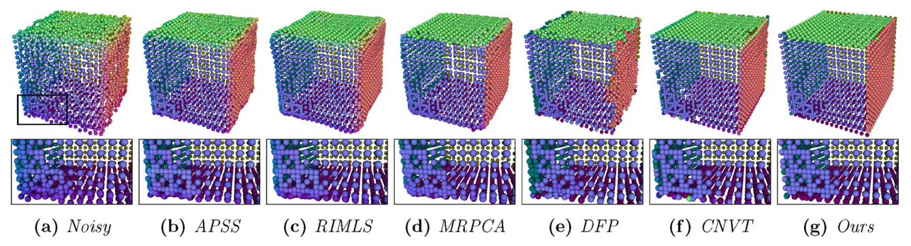

# 3D Point Cloud Denoising using Anisotropic Neighborhoods and a Novel Sharp Feature Detection Algorithm

### [Paper] [https://link.springer.com/article/10.1007/s00371-022-02698-6](https://link.springer.com/article/10.1007/s00371-022-02698-6)

### [Executable] [In the release section of this repository](https://github.com/JanHurtado/point_cloud_denoising_anisotropic_neighborhoods/releases/tag/v1.0.0)

## Authors 
[Jan Hurtado](https://scholar.google.com/citations?user=5WJK29sAAAAJ&hl=es), [Marcelo Gattass](https://scholar.google.com/citations?user=zrRqeM8AAAAJ&hl=en), and [Alberto Raposo](https://scholar.google.com/citations?user=bbNfBlwAAAAJ&hl=en).
Tecgraf PUC-Rio 

## Introduction

This implementation corresponds to the paper titled "3D Point Cloud Denoising using Anisotropic Neighborhoods and a Novel Sharp Feature Detection Algorithm" which was published in [The Visual Computer Journal](https://www.springer.com/journal/371). The code was implemented in C++ programming language and using CMake to control the compilation process.

## Abstract

3D Point cloud denoising is a fundamental task in a geometry processing pipeline, where feature preservation is essential for various applications. The literature presents several methods to overcome the denoising problem; however, most of them focus on denoising smooth surfaces and not on handling sharp features correctly. This paper proposes a new sharp feature-preserving method for point cloud denoising that incorporates solutions for normal estimation and feature detection. The denoising method consists of four major steps. First, we compute the per-point anisotropic neighborhoods by solving local quadratic optimization problems that penalize normal variation. Second, we estimate a piecewise smooth normal field that enhances sharp feature regions using these anisotropic neighborhoods. This step includes bilateral filtering and a novel corrector procedure to obtain more reliable normals for the subsequent steps. Third, we employ a novel sharp feature detection algorithm to select the feature points precisely. Finally, we update the point positions to fit them to the computed normals while retaining the sharp features that were detected. These steps are repeated until the noise is minimized. We evaluate our method using qualitative and quantitative comparisons with state-of-the-art denoising, normal estimation, and feature-detection procedures. Our experiments show that our approach is competitive and, in most test cases, outperforms all other methods.



## Compilation

Please use CMake 3.0.0 or superior.

### Dependencies

* CPLEX v20.1.0
* Eigen v3.3.4
* OpenMesh v8.1
* Geogram v1.6.9

To run our CMakeLists.txt files without applying modifications, the dependencies should have the following structure (for Windows OS):
```bash
├──readme.md
├──GENERATE_VC15_x64.bat
├──CMakeLists.txt
├──src
├──build
└──dependencies
	├──cplex
	│	├──bin
	│	│	└──cplex2010.dll
	│	├──include
	│	│	└──ilcplex
	│	│		├──cplex.h
	│	│		└──...
	│	└──lib
	│		├──cplex2010.lib
	│		└──cplex2010d.lib
	├──Eigen
	│	└──include
	│		└──Eigen
	│			└──src
	│				├──Cholesky
	│				└──...
	├──OpenMesh
	│	├──include
	│	│	└──OpenMesh
	│	│		├──Core
	│	│		└──Tools
	│	└── lib
	│		├──OpenMeshCore.lib
	│		└──OpenMeshCored.lib
	└──geogram
		├──bin
		│	└──geogram.dll
		├──include
		│	└──geogram1
		│		└──geogram
		│			├──api
		│			├──basic
		│			└──...
		└──lib
			└──geogram.lib
``` 
You can find in the Release section a zip file with the dependencies compiled with "Visual Studio 15 2017 Win64", excepting the CPLEX dependencies which should be downloaded from [https://www.ibm.com/products/ilog-cplex-optimization-studio](https://www.ibm.com/products/ilog-cplex-optimization-studio). For CPLEX, you can use the free or the academic edition. Just copy the corresponding files from the installation folder as shown in the source tree presented above. We assume that OpenMesh was compiled as an static library, so we do not need a .dll file.

### CMake build

For Windows users and using "Visual Studio 15 2017 Win64" you can run the following commands:
```bash
mkdir build
chdir build
cmake -G "Visual Studio 15 2017 Win64" -DCMAKE_INSTALL_PREFIX=install ../
``` 
The file GENERATE_VC15_x64.bat includes these commands, so you can run it instead.

### Install

By running the default commands and building INSTALL with Visual Studio, the executables and the required dll's will be generated in build/install/bin

## Running the denoising algorithm

```bash
pcdenoising.exe cube.ply cube_denoised.ply cube_params.csv cube_features.txt
``` 

cube.ply is the input point cloud with pre-computed normals. cube_denoised.ply is the output point cloud. The denoising algorithm parameters can be modified using a csv file. See this example: cube_params.csv. Read the paper for further details about them. cube_features.txt is the output file containing the detected features, where the value of the ith row corresponds to the ith point, 0 means flat point, and 1 means feature point. You can find the example files in the sample_data folder.

You can also use the executable with default parameters or avoiding the detected features output file as follows:

```bash
pcdenoising.exe cube.ply cube_denoised.ply
pcdenoising.exe cube.ply cube_denoised.ply cube_params.csv
``` 

(*) Recall that the input file requires consistently oriented pre-computed normals.

### Parameters
* n_ext (int): 9
* n_int (int): 1
* k (int): 50
* r_r (double): 3
* tau_n (double): 0.2
* alpha (double): 1
* beta (double): 0.1
* gamma (double): 0.5
* a_0_ratio (double): 0.35
* n_ns (int): 7
* sigma_nn (double): 0.3
* sigma_ns_ratio (double): 1.5
* n_nc (int): 2
* delta_cc_ratio (double): 0.5
* theta_half (double): 0.959931
* n_fp (int): 3
* upsilon_f (double): 0.3
* upsilon_ec (double): 0.5
* tau_o_ratio (double): 2

## Citation

```
@article{hurtado20223d,
  title={3D point cloud denoising using anisotropic neighborhoods and a novel sharp feature detection algorithm},
  author={Hurtado, Jan and Gattass, Marcelo and Raposo, Alberto},
  journal={The Visual Computer},
  pages={1--26},
  year={2022},
  publisher={Springer}
}
```

## License
Our code is released under MIT License (see LICENSE file for details).
